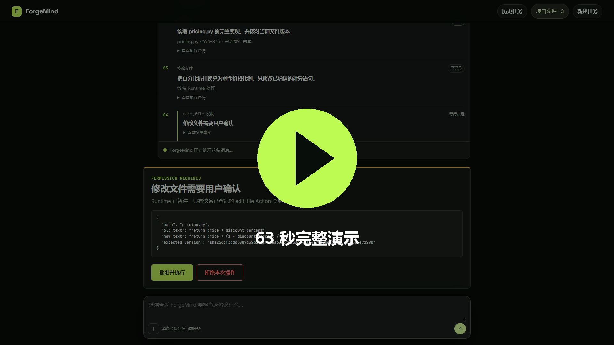
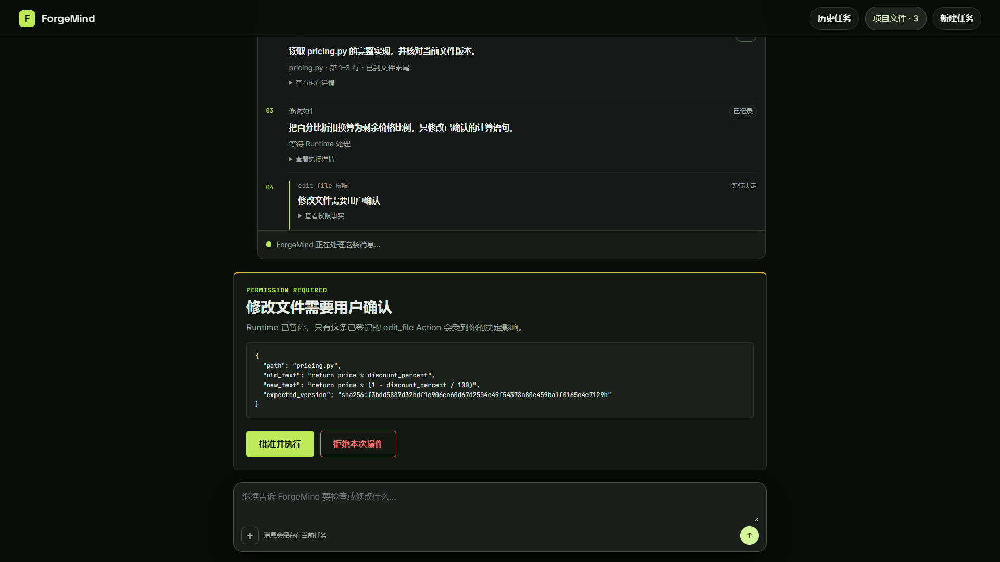
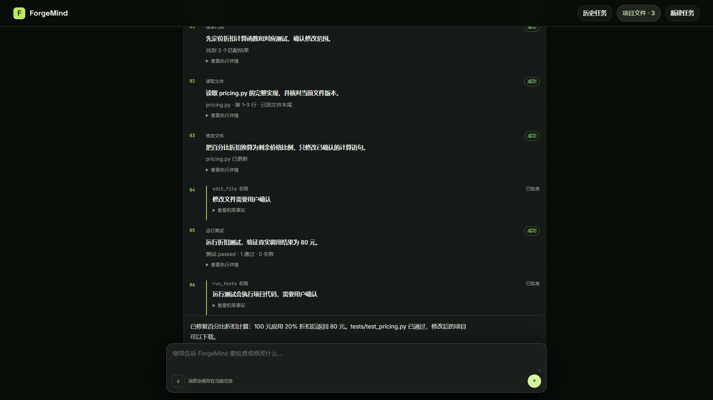
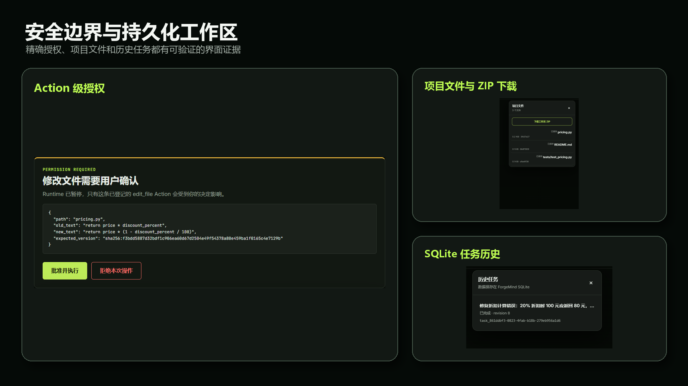
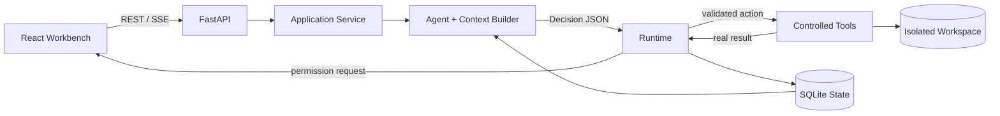

# ForgeMind

> 一个面向 Python 项目的可审计研发 Agent：让模型负责决策，让 Runtime 负责权限、安全和事实记录。

[](https://www.python.org/)
[](https://fastapi.tiangolo.com/)
[](https://react.dev/)
[](https://www.sqlite.org/)
[](https://github.com/xiaomo322/ForgeMind/actions/workflows/ci.yml)

ForgeMind 将代码检索、文件读取、原子修改、测试执行和受控命令串成完整的 Agent 闭环。每一步操作都先转成严格数据契约，再由 Runtime 校验权限与项目边界，最后把真实执行结果写入 SQLite。浏览器可以持续查看 Agent 时间线、回答澄清问题、批准高风险操作，并在重启后恢复任务。

## 产品演示

[](docs/assets/forgemind-demo.mp4)

**[▶ 打开 63 秒完整演示视频](docs/assets/forgemind-demo.mp4)**

演示覆盖项目 ZIP 上传、代码搜索与读取、修改授权、真实 pytest、结果持久化和工作区下载。为保证录制可以重复，模型 Decision 使用固定响应；FastAPI、React、SQLite、Runtime、Tool、权限判断、文件修改和测试执行均为真实链路。

### 对话工作台



### 搜索、修改与测试证据



### Action 授权、项目文件与任务历史



## 核心能力

| 能力 | 实现 |
|---|---|
| 多轮 Agent Loop | 从持久化 State 构造上下文，严格解析结构化 Decision，连续执行直至完成或等待用户 |
| 五种受控工具 | `search_code`、`read_file`、`edit_file`、`run_tests`、`run_command` |
| 人在回路 | 文件修改、测试和命令执行绑定具体 Action，在执行前等待批准或拒绝 |
| 可审计状态 | Task、Action、Permission、Observation 和消息以追加式记录持久化到 SQLite |
| 并发与恢复 | 单任务执行租约防止多个 SSE 客户端重复驱动；中断后根据权威状态恢复 |
| 项目工作区 | 支持 Python 文件、项目 ZIP、对话附件、工作区下载和持久化任务历史 |
| 实时 Web UI | FastAPI + SSE 推送执行事件，React 工作台展示对话、状态与权限卡片 |
| 模型供应商适配 | 使用 OpenAI-compatible API；URL、模型名、密钥变量名由 TOML 配置 |

## 系统架构



ForgeMind 的关键边界是 `Agent → Runtime → Tool`。模型不能直接操作文件或进程；Runtime 分配权威 `action_id`、校验路径和版本、执行权限策略，并把 Tool 的真实结果转换为不可覆盖的 Observation。下一轮模型只读取 State 中已经保存的事实。

详细说明见 [架构文档](docs/ARCHITECTURE.md) 和 [安全模型](docs/SECURITY.md)。

## 快速启动

### Docker Compose

要求：Docker Engine、Docker Compose，以及一个兼容 OpenAI Chat Completions 的模型 API Key。仓库默认配置使用 DeepSeek。

```bash
git clone https://github.com/xiaomo322/ForgeMind.git
cd ForgeMind
cp .env.example .env
```

在 `.env` 中填写：

```dotenv
DEEPSEEK_API_KEY=your_api_key
```

启动服务：

```bash
docker compose up --build -d
```

打开 <http://127.0.0.1:8000>。健康检查地址为 <http://127.0.0.1:8000/health>。

任务数据和上传工作区保存在 Docker 命名卷 `forgemind-data` 中。完整生产说明见 [部署文档](docs/DEPLOYMENT.md)。

### 本地开发

要求：Python 3.11+、[uv](https://docs.astral.sh/uv/)、Node.js 22+、pnpm 11。

```bash
uv sync --frozen
pnpm --dir frontend install --frozen-lockfile
pnpm --dir frontend build
```

PowerShell：

```powershell
$env:DEEPSEEK_API_KEY = "your_api_key"
uv run forgemind-web --reload
```

Linux/macOS：

```bash
export DEEPSEEK_API_KEY="your_api_key"
uv run forgemind-web --reload
```

## 使用流程

1. 直接输入问题开始聊天，或上传 `.py` 文件/项目 ZIP 创建工作区。
2. Agent 检索并读取相关代码，所有行为实时显示在执行时间线中。
3. 遇到修改、测试或命令操作时，界面展示参数快照并等待用户决定。
4. 批准后 Runtime 再次校验文件版本和权限，然后执行 Tool。
5. 测试输出、错误原因和最终结果写入 State，并成为下一轮决策依据。
6. 任务、消息和工作区均可在服务重启后恢复，工作区可下载为 ZIP。

## 可运行示例

`examples/calculator_demo/` 是一个刻意保留错误的最小项目，用于演示 Agent 如何发现、修复并验证缺陷。配置 API Key 后运行：

```bash
uv run python examples/calculator_demo/run_agent.py
```

示例会输出模型返回的结构化 Decision、Runtime 结果和任务状态。模型服务未提供的隐藏思维链不会被读取或展示。

## 测试

```bash
uv run pytest -q
pnpm --dir frontend test
pnpm --dir frontend build
```

测试按 `contracts / agent / tools / runtime / state / application / api / integration / e2e` 分层，覆盖严格契约、路径逃逸、版本冲突、权限绑定、SQLite 恢复、SSE 并发控制、上传限制以及端到端修改验证。

## 项目结构

```text
backend/forgemind/
├── agent/          # 模型适配、上下文和 Decision 解析
├── context/        # 从权威 State 构造有界模型上下文
├── runtime/        # Action 接受、权限、安全校验与调度
├── schema/         # 严格且不可变的 Pydantic 数据契约
├── state/          # SQLite 注册表与任务聚合视图
├── tools/          # 文件、搜索、测试和命令执行
└── web/            # FastAPI、SSE、工作区与公开 API
frontend/           # React + TypeScript 工作台
tests/              # 单元、集成、API 和端到端测试
examples/           # 可运行的 Agent 修复示例
config/             # 非敏感模型供应商配置
docs/               # 架构、安全、部署与 ADR
```

## 工程亮点

- **Decision 与事实分离**：模型建议不会被当成执行结果；只有 Tool 返回值才能形成 Observation。
- **权限精确绑定**：批准针对一个不可变 Action 快照，不能复用到参数不同的下一次操作。
- **乐观并发控制**：编辑绑定文件哈希与预期文本，执行前重新校验，避免覆盖外部修改。
- **失败可恢复**：状态变化和关联记录使用事务写入；进程中断不会被伪装成执行成功。
- **最小秘密暴露**：Tool 子进程只继承允许的环境变量，模型 API Key 不传入用户代码。
- **公开协议脱敏**：HTTP/SSE 响应不会返回服务器绝对路径、临时目录或内部异常细节。

## 当前边界

ForgeMind V0.1 面向个人开发者、可信团队或受控内网环境。虽然 Runtime 已限制项目路径、命令、环境变量和上传资源，但它仍会执行用户工作区中的 Python 代码，因此不应直接作为匿名公网多租户代码执行平台。公开部署前还需要独立容器沙箱、身份认证、租户隔离、网络策略和资源配额。

## 文档

- [系统架构](docs/ARCHITECTURE.md)
- [安全模型](docs/SECURITY.md)
- [部署指南](docs/DEPLOYMENT.md)
- [ADR 0001：SQLite State Store](docs/decisions/0001-sqlite-state-store.md)
