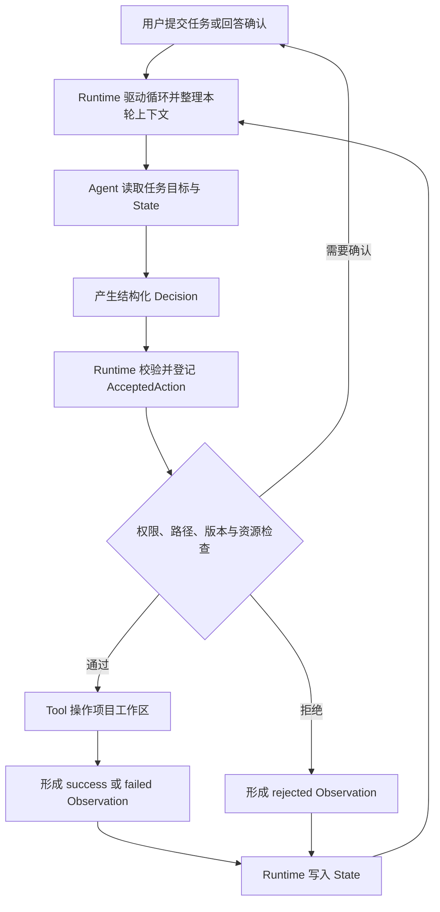

# ForgeMind 系统总体架构

**版本：V0.1**  
**状态：核心分层与四个 Tool 闭环已实现；统一 Agent Loop 待实现**

## 1. 总体关系



程序控制上由 Runtime 调用 Agent；操作请求必须沿 `Agent → Runtime → Tool` 流动。Agent 不得绕过 Runtime 直接读写文件或启动进程。

## 2. 当前代码分层

| 层 | 目录 | 职责 |
|---|---|---|
| Schema | `backend/forgemind/schema/` | 定义严格、不可变的 Decision、Action、Arguments、Result、Observation 和 Permission 契约 |
| Runtime | `backend/forgemind/runtime/` | 分配 Action 编号、登记请求、执行权限与安全检查、调用 Tool、登记终态结果 |
| Tool | `backend/forgemind/tools/` | 执行受控读取、搜索、修改和测试，不负责业务推理 |
| State | `backend/forgemind/state/` | 保存 Action、Observation、权限询问和用户决定等权威事实 |
| Tests | `tests/` | 验证数据契约、安全边界、工具行为和跨模块证据链 |

## 3. 一次操作的证据链

```text
Decision
  ↓ Runtime 校验
AcceptedAction（Runtime 分配 action_id）
  ↓ 登记到 ActionRegistry
权限与安全检查
  ↓
Tool Result 或明确错误
  ↓ Runtime 转换
Observation（success / rejected / failed）
  ↓
ObservationRegistry
```

- `Decision` 表示 Agent 建议做什么。
- `AcceptedAction` 是 Runtime 接受并登记的权威请求。
- `Result` 是 Tool 实际取得的结果。
- `Observation` 是与 Action 关联的唯一终态事实。
- `State` 是下一轮上下文的事实来源，不是 Agent 的自由描述。

## 4. 权限与安全边界

- Agent 输出必须经过 Pydantic 严格契约校验，Runtime 不猜测或补全缺失参数。
- `action_id` 由 Runtime 生成；重复编号不能覆盖已有 Action。
- 项目路径必须规范化并限制在项目根目录内。
- 文件修改绑定 `expected_version`，防止基于旧内容覆盖新修改。
- 高风险操作的用户授权绑定具体 Action 和完整参数快照。
- 命令程序由 Runtime 允许列表解析，Agent 不能提交任意可执行文件路径。
- Tool 的实际结果必须先写入 State，登记成功后才能返回给 Agent。

## 5. 当前工具状态

| Tool | 当前状态 |
|---|---|
| `read_file` | 安全路径、受限读取、版本校验和终态 Observation 已完成 |
| `search_code` | 安全范围、受限搜索和终态 Observation 已完成 |
| `edit_file` | 逐 Action 授权、唯一替换、真实 diff 和原子写入已完成 |
| `run_tests` | 显式目标、pytest 子进程、JUnit 证据和权限闭环已完成 |
| `run_command` | Schema、程序允许列表、工作目录和 Action 登记已完成；权限、Tool 和 Observation 闭环开发中 |

## 6. 尚未完成的系统层

- 统一 Agent Loop 和模型调用入口；
- 从 State 选择本轮模型上下文的 Context Builder；
- 任务级 `ForgeMindState` 聚合视图；
- State 持久化和进程重启恢复；
- 完成请求、步数上限和最终报告的统一协议；
- 真实 Python Bug 修复的端到端验收。

MVP 暂不引入 RAG、长期 Memory、Multi-Agent、Web 界面或云端部署。
