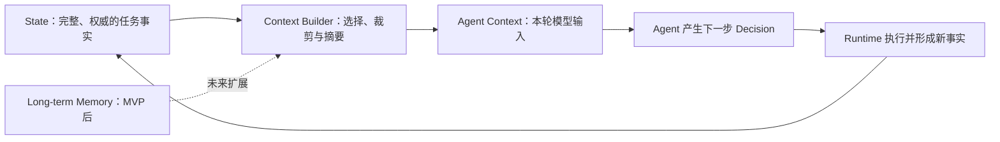

# ForgeMind 上下文与 Memory 设计

**版本：V0.1**  
**状态：四类任务事实已完成 SQLite 持久化与完整重启验证**

## 1. MVP 决定

MVP 不引入独立的长期 Memory 或向量数据库。当前先用任务 State 支撑单次 Agent Loop，避免把项目历史、用户偏好和跨任务经验提前混入核心闭环。



State 和本轮模型上下文不能混为一体。上下文可以裁剪或摘要，但不能改变 State 中的真实权限和执行结果。

## 2. 当前已经实现的事实存储

当前同时提供单进程内存 Registry 和 SQLite Registry：

| Registry | 保存内容 |
|---|---|
| `InMemoryActionRegistry` | Runtime 已接受的权威 Action |
| `InMemoryObservationRegistry` | 每个 Action 唯一的 success、rejected 或 failed 终态 |
| `InMemoryPermissionRequestRegistry` | 向用户展示的具体权限询问和操作快照 |
| `InMemoryPermissionDecisionRegistry` | 用户针对某条询问作出的最终决定 |

四个对应的 SQLite Registry 保存相同事实，并使用同一个数据库建立主键、唯一键和外键约束。完整流程已经验证：程序可以在等待用户、用户批准和命令执行之间多次重启，随后仍从数据库恢复同一条权威证据链。

Action、Observation 和权限记录通过 `task_id`、`action_id`、`permission_request_id` 与 `permission_decision_id` 建立明确关联。Registry 采用追加式规则，已有事实不能被同编号的新对象覆盖。

## 3. 规划中的任务 State

统一任务视图计划包含：

```text
ForgeMindState
├── task          用户问题、任务目标和完成条件
├── progress      当前阶段、已完成步骤和下一步
├── context       已读取文件、相关符号和必要代码片段
├── findings      候选问题、已确认问题和已否定判断
├── actions       已接受的操作请求
├── observations  操作的客观终态结果
├── verification  测试、命令和其他验证证据
└── permissions   待确认请求与用户决定
```

当前代码已经覆盖 `actions`、`observations` 和 `permissions` 的底层 Registry；其余区域尚未形成统一 Schema。

## 4. 每轮 Agent Context

未来 Context Builder 每轮应按当前决策需要选择：

- 用户任务和完成条件；
- 当前进度与最近一次 Observation；
- 与问题有关的文件内容和搜索结果；
- 已确认、待验证和已否定的判断；
- 相关测试或命令证据；
- 可用工具及其参数约束；
- 当前有效的用户限制和权限状态。

模型不应依赖自己记住前一轮对话。Runtime 每轮显式提供必要上下文，避免重复读取、重复修改或遗忘用户拒绝。

## 5. 上下文容量控制

现有 Tool 已通过协议限制原始信息规模：

- `read_file` 限制起始行和最大返回行数；
- `search_code` 限制返回条数，并用 `is_complete` 说明结果是否完整；
- 大文件、非法编码或无法安全读取的候选会被跳过并留下原因；
- `run_tests` 保存结构化统计、JUnit 证据并限制输出；
- Tool Result 使用不可变结构，避免进入上下文后被修改。

未来 Context Builder 还需要实现相关性选择、长度预算、旧结果摘要和必要原文保留。摘要必须区分客观事实与 Agent 推测，不能把猜测改写成已确认结论。

## 6. 权限不能依赖上下文摘要

给模型的上下文可能省略旧记录，但 Runtime 必须直接查询权威权限 Registry。

例如模型上下文遗漏了某次拒绝，Runtime 仍应根据 `PermissionDecisionRegistry` 阻止对应操作。上下文裁剪不能扩大权限，也不能改变文件版本或 Action 参数。

## 7. 当前限制与后续顺序

原有内存 Registry 在程序退出后会丢失。ADR-0001 选择的 SQLite 实现现已完成四类事实持久化和完整重启测试；后续按以下顺序推进：

1. 定义任务级 `ForgeMindState`；
2. 实现 Context Builder 和每轮输入预算；
3. 实现统一 Agent Loop；
4. 跑通真实 Bug 修复案例。

SQLite Registry 从 JSON 重建严格模型，因此重启后保证值和类型一致，不承诺 Python 对象身份一致。数据库主键和事务负责磁盘层防覆盖，Pydantic 负责读取时的结构校验。

权限请求已通过外键引用 actions 表，同时在 Python 层核对 task_id、action_type、tool_name 和完整 arguments 快照。数据库引用存在并不等于授权范围正确，因此两层校验都必须保留。

权限决定表同时约束 permission_decision_id 主键和 permission_request_id 唯一键。前者防止决定编号复用，后者保证同一次询问只能保存第一次最终回答；更换决定编号不能覆盖 approve 或 reject 历史。

Observation 表直接以 action_id 为主键并外键引用 Action。它表达每个 Action 的唯一终态，因此首次 success、rejected 或 failed 写入后，任何第二终态都不能覆盖原事实。

长期项目记忆、用户偏好、跨任务经验和 RAG 均不属于当前 MVP。
