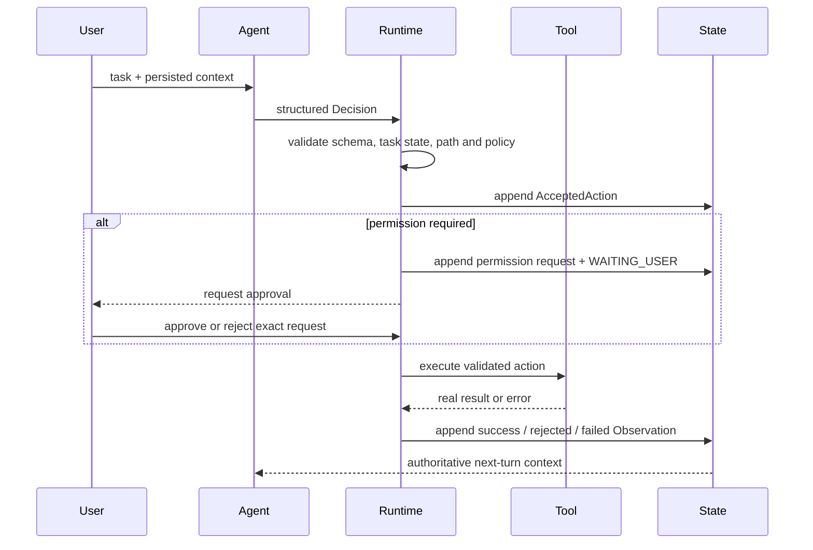

# ForgeMind Architecture

## 1. Design goal

ForgeMind is built around one constraint: a language model may propose an operation, but it cannot be the authority that says the operation was safe or successful. The system therefore separates probabilistic decisions from deterministic execution and persisted facts.

## 2. Components

| Component | Directory | Responsibility |
|---|---|---|
| Agent | `backend/forgemind/agent/` | Calls the model and parses its JSON response into one of the supported decisions |
| Context | `backend/forgemind/context/` | Builds a bounded, versioned view of the task and recent facts for the next turn |
| Schema | `backend/forgemind/schema/` | Defines strict immutable contracts for decisions, actions, permissions, observations and tasks |
| Runtime | `backend/forgemind/runtime/` | Assigns IDs, validates state and permissions, invokes tools and records outcomes |
| Tools | `backend/forgemind/tools/` | Performs file reads, source search, atomic edits, pytest runs and allowlisted commands |
| State | `backend/forgemind/state/` | Persists the append-only task history and exposes the authoritative aggregate view |
| Application | `backend/forgemind/application.py` | Drives the multi-turn loop and coordinates pause/resume behavior |
| Web | `backend/forgemind/web/` | Exposes REST/SSE APIs, workspace uploads and the production application assembly |
| Frontend | `frontend/` | Presents conversations, execution evidence, task history, files and permission prompts |

## 3. Decision-to-observation flow



The IDs in this flow are generated by Runtime. A model response does not contain an authoritative `action_id`, and a Tool result cannot be attached to another Action.

## 4. State model

SQLite stores independent registries for:

- tasks and revisioned task status;
- accepted Tool and user-question actions;
- permission requests and decisions;
- terminal observations;
- user answers and conversation messages;
- prepared edit execution plans.

Writes that must stay consistent are committed in one transaction. Task views are reconstructed from these records instead of storing a mutable serialized conversation object. This makes restart recovery and evidence inspection deterministic.

The main status transitions are:

```text
RUNNING ──> WAITING_USER ──> RUNNING
   │              │
   │              └───────> EXECUTING ──> RUNNING
   ├──> COMPLETED
   ├──> BLOCKED
   └──> CANCELLED
```

Terminal states cannot transition again. An interrupted `edit_file` can be reconciled from its persisted plan; an interrupted external process is recorded as an unknown execution result rather than silently retried.

## 5. Context management

The context builder sends the model a versioned JSON envelope containing the task, current status, messages and a bounded suffix of Action history. It also reports the total action count and whether earlier history was omitted, so truncation is explicit.

System instructions and task data use separate chat roles. Tool output and uploaded source are treated as untrusted data, not instructions. Invalid model output receives structured schema feedback and one repair attempt before the current execution stream stops.

## 6. Web execution model

REST endpoints create workspaces and tasks, submit messages, answer Agent questions and resolve permissions. `GET /tasks/{task_id}/events` drives the Agent and streams completed steps over Server-Sent Events.

A per-task execution lease prevents two SSE clients from driving the same task concurrently. Streams stop at a terminal state, when user input is required, on model/schema failure, or after the configured action budget. The browser reconnects only after an explicit state change.

## 7. Workspace lifecycle

The server maps each public `workspace_id` to a directory beneath a controlled storage root. Clients never submit a server path. A task can begin with an empty workspace, a set of flat Python files, or a validated ZIP archive. Message attachments are staged first and published into the active workspace only when the message is applied.

ZIP import rejects path traversal, absolute paths, symbolic links, encrypted entries, duplicate normalized paths and configured size/count limits before atomically publishing the workspace.
